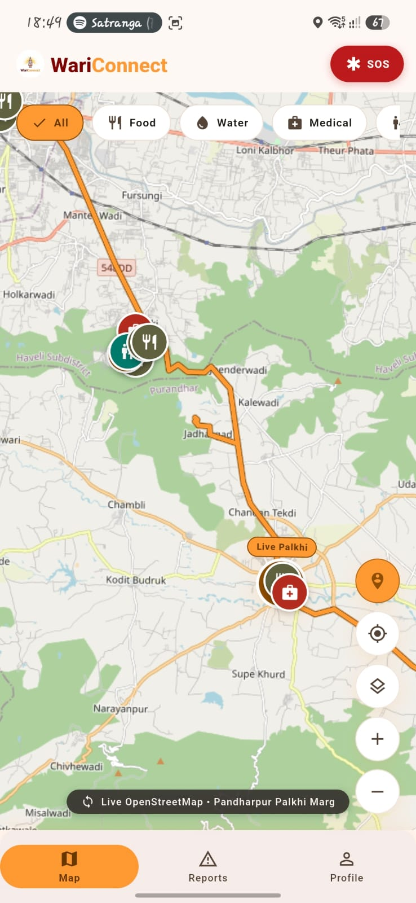
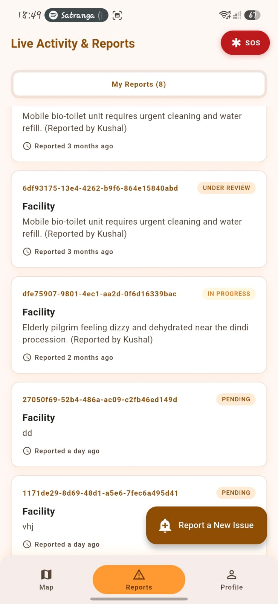
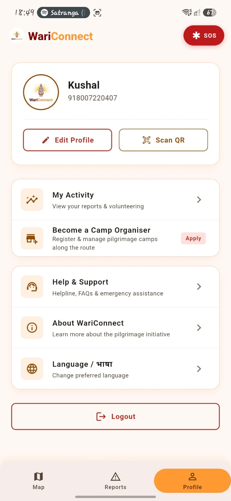
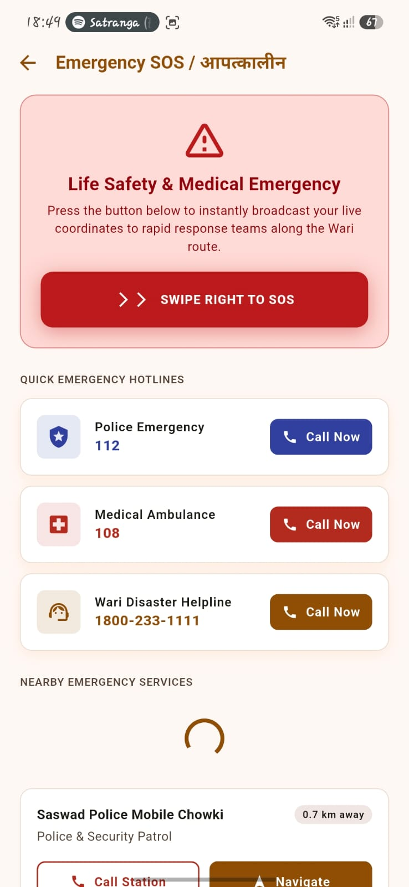
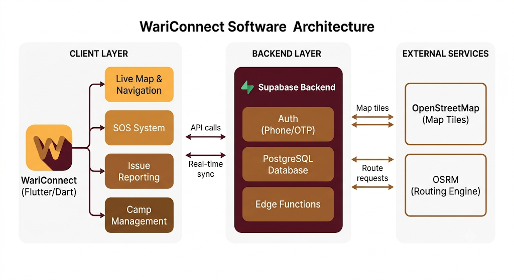

<p align="center">
  
</p>

<h1 align="center">WariConnect - Vithala Guide 🚩</h1>

<p align="center"><b>The Comprehensive Pilgrimage Companion for the Pandharpur Wari</b></p>

WariConnect digitizes and streamlines the annual Pandharpur Wari pilgrimage by connecting pilgrims (Warkaris), volunteers, and camp organisers through a unified, real-time platform — improving safety, logistics, and resource coordination for millions of devotees.

---

## ✨ Key Features

- **Live Palkhi Tracking & Navigation** — Real-time, road-snapped routing using OpenStreetMap + OSRM
- **Emergency SOS System** — One-swipe broadcast with live GPS + timestamp to alert nearby medical/police units
- **Activity & Issue Tracking** — Report and track hazards, lost persons, medical emergencies, and roadblocks
- **Camp Management** — Digital registration and management of Seva Camps (Anna Chhatra, medical camps, etc.) along the Palkhi Marg
- **Role-Based Access** — Tailored experience for Guests, Warkaris, Volunteers, and Organisers
- **Multilingual Support** — Available in Marathi and English

---

## 👥 User Roles

| Role | Capabilities |
|---|---|
| **Guest** | View live map, basic route, and general info |
| **Warkari (Pilgrim)** | Live navigation, SOS broadcasting, issue reporting, QR scanning |
| **Volunteer** | Apply for service opportunities, track hours/tasks, assist in crowd management |
| **Organiser** | Register and manage Seva Camps, track capacities, manage camp QR codes |

---

## 📱 Screenshots

<p align="center">
  
  
  
  
</p>

---

## 🏗️ Architecture

<p align="center">
  
</p>

The Flutter client communicates with a Supabase backend (Auth, PostgreSQL, Edge Functions) for OTP login, real-time data sync, and issue/camp management, while OpenStreetMap and OSRM power live map tiles and route calculation.

---

## 🛠️ Tech Stack

- **Frontend**: Flutter (Dart) — cross-platform iOS & Android
- **Backend**: Supabase (PostgreSQL, Auth, Edge Functions)
- **Mapping**: `flutter_map` with OpenStreetMap tile layers + OSRM for routing
- **Design**: Material Design 3 with a custom saffron / deep maroon / earthy-tone palette

---

## ⚙️ How It Works

### Live & Dynamic
- Phone-based OTP authentication (Supabase Auth) with persistent sessions via `SharedPreferences`
- Role-based UI that restructures dynamically per user role
- Real-time GPS tracking, ETA calculation (avg. 4 km/h walking speed), and live routing via OSRM
- Real-time issue reporting synced to Supabase (`issue_reports` table)
- Multi-step organiser applications validated and pushed as structured JSON
- Relative timestamps (e.g. "5 mins ago") via `timeago`

### Currently Simulated (for demo/testing)
- SOS broadcast trigger (GPS + timestamp are real; backend push is simulated)
- Volunteer opportunities list (static local data)
- Facility/camp map pins (static data in `AppState`)
- QR payload processing after scan

---

## 🚀 Getting Started

```bash
# Clone the repo
git clone https://github.com/Yato-22/wari-app.git
cd wari-app

# Run the app (on a connected Android device/emulator)
flutter run
```

---

## 👨‍💻 Team — UniQrew

- Kushal Patil
- Nishant Patil
- Shashank Nemane
- Utkarsh Morey
- Yash Phadnis

---

## 📄 License

This project is licensed under the [MIT License](LICENSE) — free to use, modify, and distribute.
